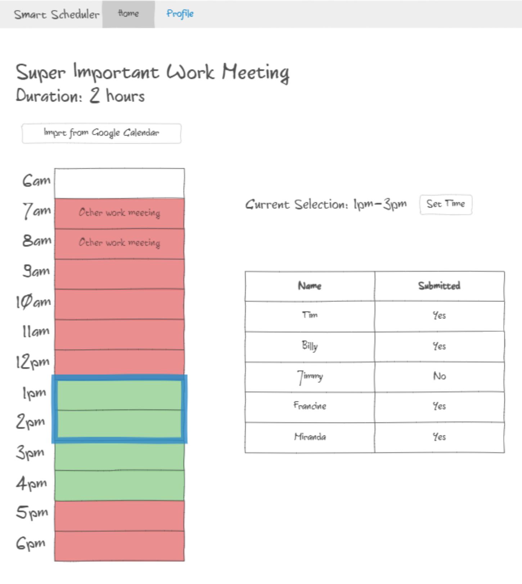

# Startup
## Notes
In this assignment, I learned how to:
- Use Git
- Use Git functionality in VS Code
- Resolve merge conflicts
- Push/Pull changes   

AWS:
- IP: http://3.15.103.8/
- `ssh -i [key pair file] ubuntu@3.15.103.8`
- URL: https://smartscheduler.link/
# Smart Scheduler
## Design
Have you ever tried to coordinate a meeting or event with several different people who all have different schedules? It is never easy. Smart Scheduler makes it easy to plan events and find a time that works for everyone. One person can create an event and can specify how long it is expected to take. Everyone involved in the meeting can open the application, import their schedule for that day from their Google calendar, and make any adjustments to the schedule. Smart Scheduler will then display the times that everyone is free. Once a time is selected, users will have the choice to add the event to their calendar.   

### Key Features
- Secure Login over HTTPS
- Ability to import from Google Calendar
- Ability to modify available times
- Display of available/not available times
- Compare/update schedules in realtime
